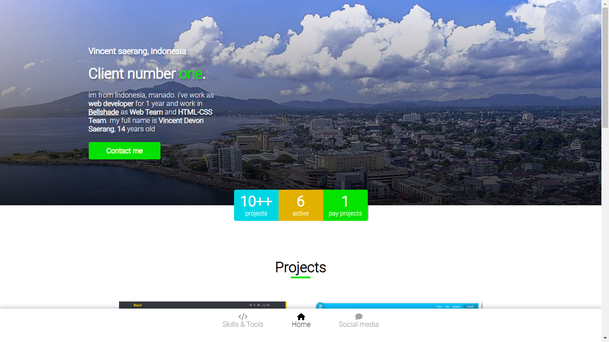

# Vincent Saerang - Portofolio
This website for my portofolio, this code is free to use.
this is single web app (SWA) made with Vanilla Javascript, CSS, HTML 

# Make with
- HTML
- CSS
- JavaScript
- easy-doc
- font awesome v5.15

# File structure
```
> css
>> style.css

> img
>> A LOT OF IMAGE

> js
>> script.js

> index.html
> README.md (this)
```

## give a star pls

# Current version 1.0.1